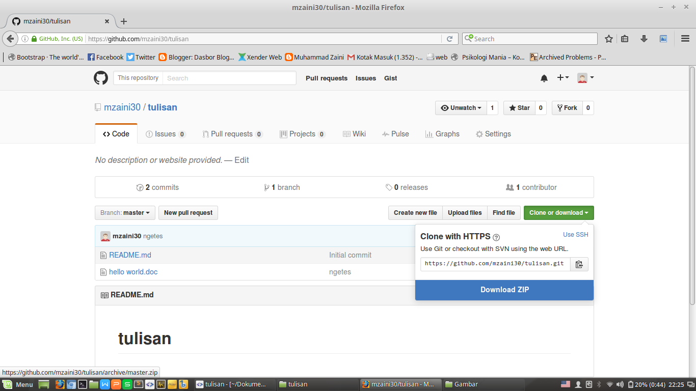
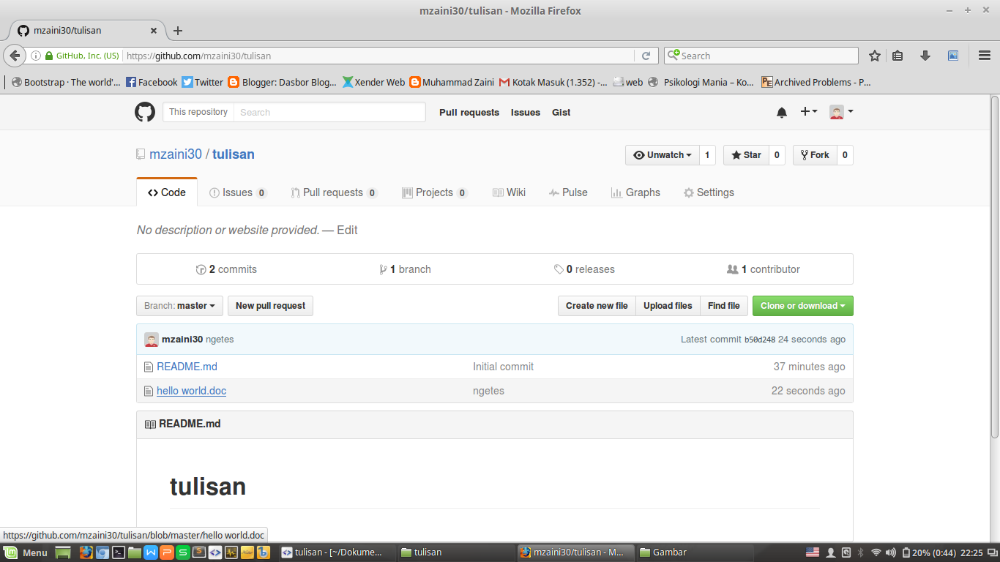
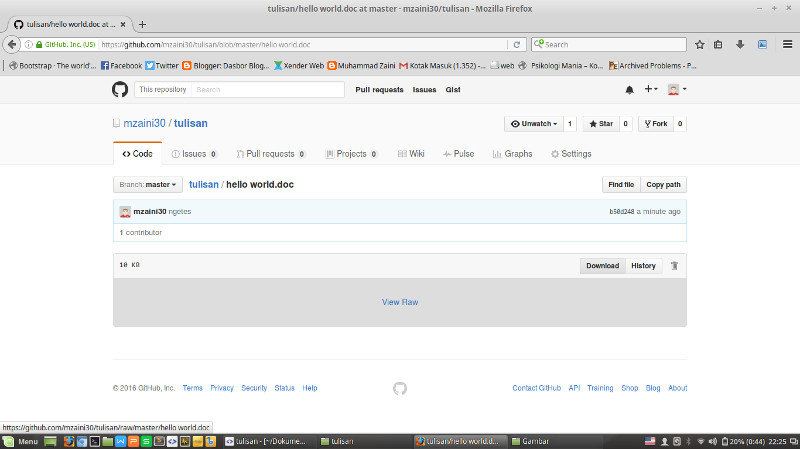

# Ini adalah Kumpulan Tulisan

Repositori ini aku buat dengan tujuan untuk memudahkan aja bagi para netizen yang ingin mengunduh tulisan yang aku buat. Kelebihan repositori ini dibandingkan dengan blog adalah kamu cukup mengunduh tulisan ini sekali saja jadi tidak perlu menggunakan koneksi internet berkali-kali. Lalu, bagaimana cara mengunduhnya? Simak uraian di bawah ini:

## Cara Mengunduh

### Mengunduh Satu Repositori (Semua Tulisan)

 

1. Klik tombol hijau di bagian kanan yang bertuliskan "Clone or Download"
2. Pilih "Download ZIP"

### Mengunduh Tulisan Satu Per Satu

1. Klik tulisan yang mau kamu unduh. Kalau contoh di bawah ini, aku mencoba mengunduh "hello world.doc"

	 
	
2. Klik tombol "Download"

	 
	
Ada pertanyaan? Hubungi aku melalui kontak di bawah ini:

* LINE: [mzaini30](http://line.me/ti/p/~mzaini30)
* Telegram: [@mzaini30](http://telegram.me/mzaini30)
* Facebook [facebook.com/mzaini30](http://facebook.com/mzaini30)
* Twitter: [@mzaini30](http://twitter.com/mzaini30)